# Microchip Zephyr dsPIC33A DSC User Guide

### Table of Contents

[1 Introduction ](#introduction)

[2 Software and Hardware Requirements ](#software-and-hardware-requirements)

[2.1 Software Requirements ](#software-requirements )

[2.2 Hardware Requirements ](#hardware-requirements)

[3 Execution guidelines ](#execution-guidelines)

[3.1 Setting Up the Basic Environment ](#setting-up-the-basic-environment)

[3.2 Setting Up the Basic Development Environment ](#setting-up-the-basic-development-environment)

[3.2.1 Windows: ](#windows)

[3.2.2 Linux: ](#linux)

[3.3 Setting Up Curiosity Board ](#setting-up-curiosity-board)

[3.4 Setting Up the Debug Environment ](#setting-up-the-debug-environment)

[3.4.1 Debug on Windows ](#debug-on-windows)

[3.4.2 Debug on Linux ](#debug-on-linux)

[3.4.3 Example Applications ](#example-applications)

[4 UART Console ](#uart-console)

[4.1 UART console on Windows: ](#uart-console-on-windows)

[4.2 UART Console on Linux: ](#uart-console-on-linux)

[5 Running Tests(ztest/twister) ](#running-tests-ztesttwister)

[5.1 Key Folders for Kernel ztest in Zephyr ](#key-folders-for-kernel-ztest-in-zephyr )

# Introduction

Microchip's dsPIC33A DSCs now support the open-source Zephyr® Real-Time Operating System (RTOS). Leveraging this open-source ecosystem gives you access to a unified platform for building robust and scalable embedded applications. As a proud Silver Member of the Zephyr Project, Microchip provides seamless alignment of our dsPIC33A hardware with Zephyr’s RTOS to deliver an accelerated, reliable path from prototype to deployment.

# Software and Hardware Requirements

This section describes the required tools and environment setup for the zephyr port for Microchip dsPIC.

## Software Requirements

Below are the software requirements for Zephyr for Microchip dsPIC.

*   Links for Zephyr repository and microchip boards
    *   [https://github.com/Zephyr4Microchip/zephyr/tree/dsPIC33A](https://github.com/Zephyr4Microchip/zephyr/tree/dsPIC33A)
    *   [https://github.com/Zephyr4Microchip/zephyr/tree/dsPIC33A/boards/microchip](https://github.com/Zephyr4Microchip/zephyr/tree/dsPIC33A/boards/microchip)
*   Tools and setup mentioned in the zephyr repo setup : [**Getting Started Guide — Zephyr Project Documentation**](https://docs.zephyrproject.org/latest/develop/getting_started/index.html)**_._**
*   xc-dsc compiler version 3.31:
    *   Windows : [xc-dsc compiler for Windows](https://www.microchip.com/en-us/tools-resources/develop/mplab-xc-compilers/xc-dsc)
    *   Linux: [xc-dsc compiler for Linux](https://www.microchip.com/en-us/tools-resources/develop/mplab-xc-compilers/xc-dsc)
*   MPLAB® X Integrated Development Environment (IDE): [MPLABxIDE Download](https://www.microchip.com/en-us/tools-resources/develop/mplab-x-ide)

## Hardware Requirements

Below are the hardware requirements for Zephyr for Microchip dsPIC.

*   Curiosity platform development board – [EV74H48A](https://www.microchip.com/EV74H48A)
*   dsPIC33AK128MC106 General Purpose Dual In-Line Module (DIM) - [EV02G02A](https://www.microchip.com/EV02G02A)
*   dsPIC33AK512MPS512 General Purpose Dual In-Line Module (DIM) - [EV80L65A](https://www.microchip.com/EV80L65A)
*   The full list of supported Microchip boards/SOC's is available in the Zephyr repository - [boards](https://github.com/Zephyr4Microchip/zephyr/blob/dsPIC33A/boards/microchip/dspic33/dspic33a_curiosity/board.yml)
*   USB Type C cable.

# Execution guidelines

## Setting Up the Basic Development Environment

*   Follow the steps mentioned in the zephyr documentation to set up the zephyr repository and SDK \[[**Getting Started Guide — Zephyr Project Documentation**](https://docs.zephyrproject.org/latest/develop/getting_started/index.html)\].

## Setting Up Development environment

*   Install the xc-dsc compiler version 3.31 or later.
    *   Windows : **xc-dsc compiler for Windows**
    *   Linux : [**xc-dsc compiler for Linux**](https://www.microchip.com/en-us/tools-resources/develop/mplab-xc-compilers/xc-dsc)
*   Install MPLAB IDE (v6.25 or later).
    *   [**MPLAB® X IDE | Microchip Technology**](https://www.microchip.com/en-us/tools-resources/develop/mplab-x-ide)
    *    Make sure to install the MPLABX IPE along with MPLABX IDE
*   Install the dependencies (python, cmake and device tree compiler) for zephyr build.

### Windows:

*   1.  In modern Windows versions, winget is already pre-installed by default. You can verify that this is the case by typing winget in a terminal window. If that fails, you can then [install winget](https://aka.ms/getwinget).
    2.  Open a Command Prompt (cmd.exe) or PowerShell terminal window. To do so, press the Windows key, type cmd.exe or PowerShell and click on the result.
    3.  Use winget to install the required dependencies:

```
winget install Kitware.CMake Ninja-build.Ninja oss-winget.gperf Python.Python.3.12 Git.Git oss-winget.dtc wget 7zip.7zip
```

*   4.  Verify the dependencies are installed by checking the version.

```
cmd > cmake --version //ensure cmake version is 4.0.2 or later
cmd > python3 --version //ensure python version is 3.12.11 or later , some system python command works instead of python3
cmd > dtc --version //ensure dtc version is 1.6.1 or later
```

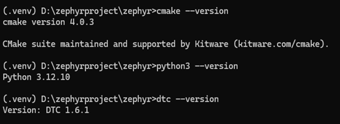

*   5.  Clone zephyr repository using the following commands in command prompt:

```
cmd > cd %HOMEPATH% (if environmenet variable is not defined use the home directory e.g. cd C:\users\user1)
cmd > python -m venv zephyrproject\.venv
cmd > zephyrproject\.venv\Scripts\activate.bat
cmd > pip install west
cmd > west init -m https://github.com/Zephyr4Microchip/zephyr --mr dsPIC33A zephyrproject
cmd > cd zephyrproject
cmd > west update
cmd > west zephyr-export
cmd > west packages pip --install
```

*   6.  Or clone zephyr repository using the following commands in powershell:_
```
cmd > cd %HOMEPATH% (if environmenet variable is not defined use the home directory e.g. cd C:\users\user1)
cmd > python -m venv zephyrproject\.venv
cmd > Set-ExecutionPolicy -ExecutionPolicy RemoteSigned -Scope CurrentUser
cmd > zephyrproject\.venv\Scripts\Activate.ps1
cmd > pip install west
cmd > west init -m https://github.com/Zephyr4Microchip/zephyr --mr dsPIC33A zephyrproject
cmd > cd zephyrproject
cmd > west update
cmd > west zephyr-export
cmd > west packages pip --install
```

*   7.  Use the west command to build the code, as shown in the below image.
```
cmd > west build -b dspic33a_curiosity/p33ak512mps512 -p always ./samples/hello_world/ -- -DZEPHYR_TOOLCHAIN_VARIANT=xcdsc -DXCDSC_TOOLCHAIN_PATH=”C:\Program Files\<path-to-xc-dsc-installation>”
```

*   8.  Note: Usually, XC-DSC will be installed in C:\\Program Files\\

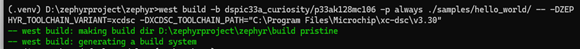

*   9.  This will generate the final elf file under the zephyr build folder.
            *   zephyrproject/zephyr/build/xephyr/zephyr.elf
*  10.  Alternatively, the west build command can be used without passing –D arguments. For that need to set the environment variables
            If using command prompt, set the environment variables as the following


```
cmd > set ZEPHYR_TOOLCHAIN_VARIANT=xcdsc
cmd > set XCDSC_TOOLCHAIN_PATH=C:\Program Files\<path-to-xc-dsc-installation>  (e.g. set XCDSC_TOOLCHAIN_PATH=C:\Program Files\Microchip\xc-dsc\v3.31)
```

*   And in power shell,
```
cmd > $env:ZEPHYR_TOOLCHAIN_VARIANT=”xcdsc”
cmd > $env:XCDSC_TOOLCHAIN_PATH=”C:\Program Files\<path-to-xc-dsc-installation>” (e.g. $env:XCDSC_TOOLCHAIN_PATH="C:\Program Files\Microchip\xc-dsc\v3.31")
```

*   And use the following west build command,
```
cmd > west build -b dspic33a_curiosity/p33ak512mps512 -p always ./samples/hello_world/
```

### Linux:

*   1.  use the following commands to install the dependencies
```
cmd > wget https://apt.kitware.com/kitware-archive.sh
cmd > sudo bash kitware-archive.sh
cmd >sudo apt install --no-install-recommends git cmake ninja-build gperf \ccache dfu-util device-tree-compiler wget \python3-dev python3-pip python3-setuptools \python3-tk python3-wheel xz-utils file \
cmd > make gcc gcc-multilib g++-multilib libsdl2-dev libmagic1
```

*   2.  Verify the dependencies are installed by checking the version.
```
cmd > cmake --version, Ensure cmake version is 4.0.2 or later
cmd > python3 --version, Ensure python version is 3.12.11 or later
cmd > dtc - -version, Ensure dtc version is 1.6.1 or later
```

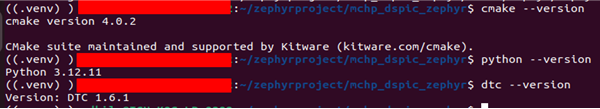

*   3.  _Clone zephyr repo. use the following commands._
```
cmd > python3 -m venv zephyrproject/.venv
cmd > source zephyrproject/.venv/bin/activate
cmd > pip install west
cmd > west init -m https://github.com/Zephyr4Microchip/zephyr --mr dsPIC33A zephyrproject
cmd > cd zephyrproject
cmd > west update
cmd > west zephyr-export
cmd > west packages pip --install
```

*   4.  Set the environment variables. Use the commands as in the below image to set the environment variables.

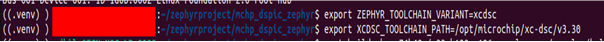

```
ZEPHYR_TOOLCHAIN_VARIANT=xcdsc
XCDSC_TOOLCHAIN_PATH=<path-to-xc-dsc-installation> (e.g. set XCDSC_TOOLCHAIN_PATH=/opt/microchip/xc-dsc/v3.31)
```

*   5.  Use the west command to build the code, as shown in the below image.

```
west build -p always -b dspic33a_curiosity/p33ak512mps512 samples/hello_world/ -- -DZEPHYR_TOOLCHAIN_VARIANT=xcdsc -DXCDSC_TOOLCHAIN_PATH=<path-to-xc-dsc-installation>
```

*   6.  This will generate the final elf file under the zephyr build folder.
            *   zephyrproject/zephyr/build/zephyr/zephyr.elf

## Setting Up Curiosity board

*   Connect type C USB cable to board.
*   Disconnect Jumper J28 to activate pkob4.
*   Short Jumper J25 to use supply from USB instead of an external supply.
*   In the picture below marks the required connections

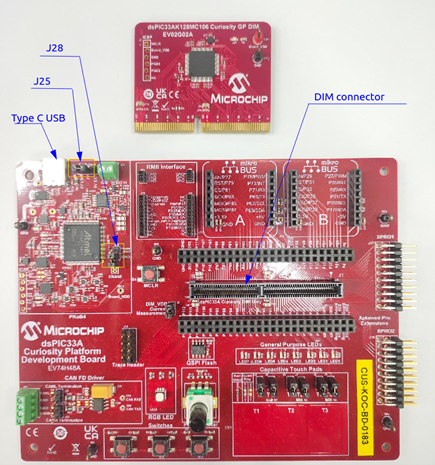

## Setting Up the Debug Environment

### Debug On Windows

*   Install the latest version (v6.25 and later) of MPLAB X IDE, MDB is installed as part of installation of MPLAB X IDE.
*   Check the board is detected, use the “Device Manager”->” Ports”.
*   Type in “**mdb**” in command prompt or in powershell to launch debugger, this will start a debugger session. If the command is not recognized make sure the mdb path(mplab_platform/bin)
    is added to the PATH environment variable.

    

*   Type in “**Device <Device name>**” to select the device. To select dsPIC33AK128MC106 as device type in **Device dsPIC33AK128MC106**
*   Type in “**Hwtool pkob4**” to select the Programmer/debugger.

    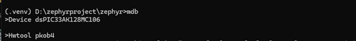

*   This will give the following output. Use command “**Program <filename.elf>**” to program the board. Use the zephyr.elf generated in the earlier step \[Refer dev environment section\].

    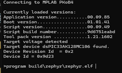

*   If the device is programmed successfully, following response will be received.

    

*   Use command “**Break main”** to set a breakpoint at main. Use command “**Run**” to run the program. The execution will halt at the main.

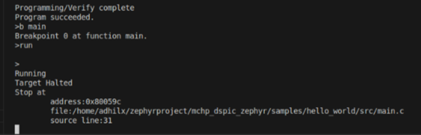


### Debug On Linux

*   Install the latest version (v6.25 and later) of MPLAB X IDE, MDB is installed as part of installation of MPLAB X IDE.
*   Check the board is detected using the command **lsusb,** to see the device is detected.
*   Type in “**mdb**” to launch debugger, this will start a debugger session.
*   Type in “**Device <Device name>**” to select the device. To select dsPIC33AK128MC106 as device type in **Device dsPIC33AK128MC106.**
*   Type in “**Hwtool pkob4**” to select the Programmer/debugger.

    

*   Use command “Program <filename.elf>” to program the board. Use the zephyr.elf generated in the earlier step [Refer dev environment section].

  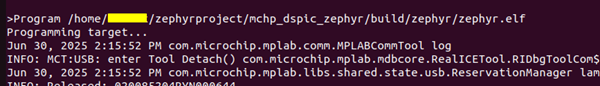

*  If the device is programmed successfully, following response will be received.

   

*  Use command “**Break main”** to set a breakpoint at main. Execute the program but issuing the **‘Run’ command.** The execution will halt at main.

   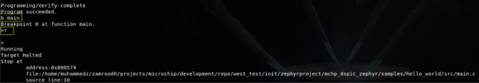


### Example Applications

Microchip provides support for the following example applications that can be readily executed on dsPIC33A families to demonstrate the unique capabilities of Zephyr RTOS platform. It will help you quickly get started with Zephyr and rapidly develop your application and deploy in market.

1.  Hello World - The simplest Zephyr application. Prints "Hello World!" to the console on virtually any supported board.
2.  Dining Philosophers - A classic demonstration of multi-thread synchronization. Implements the Dining Philosophers problem using multiple preemptible and cooperative threads with different priorities, dynamic mutexes, and thread sleep functions.
3.  Blinky - A simple example that can be used with most supported boards that periodically blinks one or more on-board LEDs to demonstrate basic GPIO control and timer usage in Zephyr.

# UART Console

The Console can be accessed using On-Board USB interface. Open a console application of your choice (eg: TeraTerm/PuTTY) and use the below configuration for setting up the console.


**Baudrate : 115200**

**HW Flow control : No**

**Data bits : 8**

**Stop bits : 1**

Below section will describe how the console is set up on both windows and Linux.

## UART console on Windows:

*   After connecting the device, look for the COM port in Device Manager for the USB.
*   Open **Putty and** select **serial.**
*   Give the COM port corresponding to the board which is connected to PC.
*   Give the baud rate as **115200\.** Then click Open.

    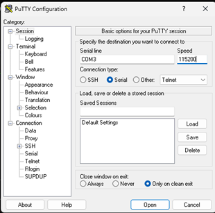

## UART Console on Linux:

*   After connecting the device, list the COM port available using command,
    **ls /dev/ttyACM\*,** From the list select second serial instance (if enumerated devices are ttyACM0 and ttyACM1 select ttyACM1).
*   Type in **sudo minicom -s** which will pop up a window as shown below.

    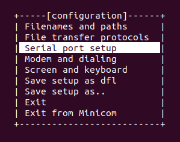

*   Select serial port setup and update the configurations.

After saving configurations, exit from menu to continue to console

<a id="running-tests-ztesttwister"></a>
# Running Tests(ztest/twister)

To test dsPIC33A Zephyr port the release leverages the built-in unit testing framework located in the Zephyr source tree. These tests validate core kernel features like threads, synchronization, memory, and timing.

## Key Folders for Kernel ztest in Zephyr

| Folder | Purpose |
| --- | --- |
| tests/kernel/common/ | General kernel behavior and sanity checks |
| tests/kernel/fatal/ | Tests for fatal error handling and exception behavior |
| tests/kernel/threads/ | Thread creation, priorities, and context switching |
| tests/kernel/sched/ | Scheduler behavior, preemption, and time slicing |
| tests/kernel/mem_protect/ | Memory protection, user/kernel space separation |
| tests/kernel/mem_heap/ | Kernel memory heap allocation and fragmentation |
| tests/kernel/mem_slab/ | Memory slab allocator tests |
| tests/kernel/pipe/ | Kernel pipe APIs for inter-thread communication |
| tests/kernel/queue/ | Kernel queue APIs and synchronization |
| tests/kernel/semaphore/ | Semaphore synchronization primitives |
| tests/kernel/mutex/ | Mutex locking and priority inheritance |
| tests/kernel/timer/ | Kernel timer APIs and timing accuracy |
| tests/kernel/workq/ | Work queue and deferred execution tests |
| tests/kernel/condition_variables/ | Condition variable synchronization |
| tests/kernel/init/ | Kernel initialization and boot sequence validation |
| tests/kernel/interrupt/ | Interrupt handling and nesting behavior |
| tests/kernel/stack/ | Stack usage, overflow detection, and stack APIs |
| tests/kernel/timeout/ | Timeout and delay mechanisms |
| tests/kernel/fifo/ | FIFO queue operations and thread synchronization |
| tests/kernel/lifo/ | LIFO queue operations and thread synchronization |

These tests are run using:
```
west build -b <your\_board> tests/kernel/<test\_name>

west flash
```

Alternatively, you can test using the **Twister test suite** by using the following command from the root of your Zephyr workspace:
```
 python scripts\twister --device-testing --device-serial <COM port> --device-serial-baud <baud rate> -p <platform> -T tests/kernel --short-build-path

e.g. python scripts\twister --device-testing --device-serial COM3 --device-serial-baud 115200 -p dspic33a_curiosity/p33ak512mps512 -T tests/kernel --short-build-path
```

**Note:** **_In the above twister command the flag, --short-path is optional and can be removed if running twister on a linux platform, and COM port should be the one used for uart console_**